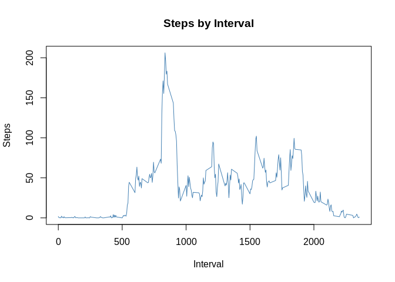

# Reproducible Research: Peer Assessment 1
A student-submitted project.

## Loading and preprocessing the data

Let's start off by importing some useful libraries.

```r
library(ggplot2)
library(plyr)
```

Next, let's read in the data.

```r
if (!file.exists("activity.csv")) unzip("activity.zip")
if (!exists("act_data")) act_data <- read.csv("activity.csv")
```
Properly, we should have to get rid of all the NA values in our dataset. However, we can safely ignore this step for now.


In terms of preprocessing, we just want to add a weekday column to our dataset. This will help us out in the imputation section.

```r
act_data$weekday <- tolower(weekdays(as.Date(act_data$date)))
```

Let's check that our data loaded properly. The first few rows should have NA values for the `steps` column.

```r
head(act_data)
```

```
##   steps       date interval weekday
## 1    NA 2012-10-01        0  monday
## 2    NA 2012-10-01        5  monday
## 3    NA 2012-10-01       10  monday
## 4    NA 2012-10-01       15  monday
## 5    NA 2012-10-01       20  monday
## 6    NA 2012-10-01       25  monday
```


## What is mean total number of steps taken per day?

The first step here, logically, is to sum up the data per day. Let's do this using the `aggregate` function.

```r
ad.by_day <- aggregate(steps ~ date, act_data, sum)
```

Using the `ggplot2` plotting system's `ggplot` function, we create the following histogram.

```r
ggplot(ad.by_day, aes(steps, fill="steelblue")) + geom_histogram() +           # histogram of the data
  labs(x="Steps", y="Count") + ggtitle("Steps by Day") +                       # appropriate labels
  theme_bw() + theme(plot.title = element_text(hjust = 0.5)) + guides(fill=F)  # a bit of personalization
```

```
## `stat_bin()` using `bins = 30`. Pick better value with `binwidth`.
```

<!-- -->


Our goal, of course, is to report the mean and median of the number of steps taken per day.

```r
mean(ad.by_day$steps)
```

```
## [1] 10766.19
```

```r
median(ad.by_day$steps)
```

```
## [1] 10765
```


## What is the average daily activity pattern?

Similar to the first step in the previous section, let's `aggregate` the data per interval. This time, we're using the average across all the given days.

```r
ad.by_int <- aggregate(steps ~ interval, act_data, mean)
```

Let's create a time-series plot using the base plotting system's `plot` function.

```r
plot(ad.by_int$interval, ad.by_int$steps, type="l", main="Steps by Interval", 
     xlab="Interval", ylab="Steps", col="steelblue")
```

<!-- -->


To find the interval with the maximum steps, we run the following line.

```r
ad.by_int$interval[which.max(ad.by_int$steps)]
```
This tells us that our max-steps interval is the one starting at 835.


## Imputing missing values

The number of missing step values can be found using the next line.

```r
sum(is.na(act_data$steps))
```
There are 2304 missing values in the dataset.

People usually have similar routines on the same day each week. Remember the `weekday` column we created in preprocessing? Let's use that. For missing values, we'll fill in averages of the same weekday and interval, but before that we need to create a dataset with those averages.

```r
ad.by_both <- aggregate(steps ~ interval + weekday, act_data, mean)
```


Printing the first few rows shows us some zero-step rows. If you think this is bizarre, realize that the first few rows show the early morning hours.

```r
head(ad.by_both)
```

```
##   interval weekday steps
## 1        0  friday     0
## 2        5  friday     0
## 3       10  friday     0
## 4       15  friday     0
## 5       20  friday     0
## 6       25  friday     0
```
The 600-604 minute interval on a Friday morning shows 13. This represents 10:00-10:04 AM, so the number of steps makes more sense.

Let's make a separate dataset to use and populate it with matched data. Additionally, we'll `aggregate` the daily sums for the imputed data.

```r
ad.imputed <- transform(
  act_data, 
  steps = ifelse(is.na(act_data$steps), 
                 ad.by_both$steps[match(ad.by_both$interval, act_data$interval) &
                                    match(ad.by_both$weekday, act_data$weekday)], 
                 act_data$steps))

ad.imp_by_day <- aggregate(steps ~ date, ad.imputed, sum)
```


Now, let's plot histograms of both datasets, adding the original data on top of the imputed data.

```r
par(mfrow=c(1,2))

hist(ad.imp_by_day$steps, main = paste("Steps by Day - Imputed"), col="steelblue", 
     xlab="Steps", ylim=c(0, 40))
hist(ad.by_day$steps, main = paste("Steps by Day - Original"), col="gold", 
     xlab="Steps", ylim=c(0, 40))
```

<!-- -->

Here's what the histograms look like, superimposed.

```r
par(mfrow=c(1,1))

hist(ad.imp_by_day$steps, main = paste("Steps by Day"), col="steelblue", 
     xlab="Steps", ylim=c(0, 40))
hist(ad.by_day$steps, main = paste("Steps by Day"), col="gold", 
     xlab="Steps", ylim=c(0, 40), add=T)

legend("topright", c("Imputed", "Original"), col=c("steelblue", "gold"), lwd=2)
```

<!-- -->


Immediately, we notice that a couple of the peaks (specifically the ones between 5000 and 15000 steps) are taller with the superimposed data. Let's see how this changes our mean and median.

```r
mean(ad.imp_by_day$steps)
```

```
## [1] 10775.51
```

```r
median(ad.imp_by_day$steps)
```

```
## [1] 11015
```

For comparison's sake, let's check out the difference between the means and medians, with and without imputed data.

```r
100 * ((mean(ad.imp_by_day$steps) - mean(ad.by_day$steps)) / mean(ad.imp_by_day$steps))        # %
```

```
## [1] 0.08654527
```

```r
100 * ((median(ad.imp_by_day$steps) - median(ad.by_day$steps)) / median(ad.imp_by_day$steps))  # %
```

```
## [1] 2.269632
```


## Are there differences in activity patterns between weekdays and weekends?

Let's create a `week` that'll hold "end" for Saturdays and Sundays, "day" for all other weekdays.

```r
ad.imputed$week = as.factor(ifelse(ad.imputed$weekday %in% c("saturday", "sunday"), "end", "day"))
```

Let's `aggregate` based on our `interval` and `week` factors.

```r
ad.by_week <- aggregate(steps ~ interval + week, ad.imputed, mean)
```


Now, we'll plot the two time series plots separately.

```r
par(mfrow=c(2,1))

with (ad.by_week[ad.by_week$week == "day",], plot(interval, steps, type="l", main="Steps by Interval - Weekdays",
                                                  xlab="Interval", ylab="Steps", col="steelblue"))

with (ad.by_week[ad.by_week$week == "end",], plot(interval, steps, type="l", main="Steps by Interval - Weekends",
                                                  xlab="Interval", ylab="Steps", col="firebrick"))
```

<!-- -->

To finish off our project, let's go ahead and graph the two time series plots on top of each other.

```r
par(mfrow=c(1,1))

with (ad.by_week[ad.by_week$week == "day",], plot(interval, steps, type="l", main="Steps by Interval", 
     xlab="Interval", ylab="Steps", col="steelblue"))

with (ad.by_week[ad.by_week$week == "end",], lines(interval, steps, type="l", col="firebrick"))

legend("topright", legend=c("Weekdays", "Weekends"), col=c("steelblue", "firebrick"), lwd=c(2,2))
```

<!-- -->

One of the most important features to note is that the y-range on the week*days* graph peaks at a bit over 200 steps, while the y-range on the week*ends* graph peaks at just around 150 steps.


That concludes this project and (hopefully) satisfies all the requirements set forth by the directions. Cheers!

